# 分布式篇  
+ 基础介绍及springsecurity单例demo参考oauth2文件夹中的HELP.md  
# 1. 什么是分布式系统  
+ 将单体结构的系统拆分为若干服务，服务之间通过网络交互来完成用户的业务处理  
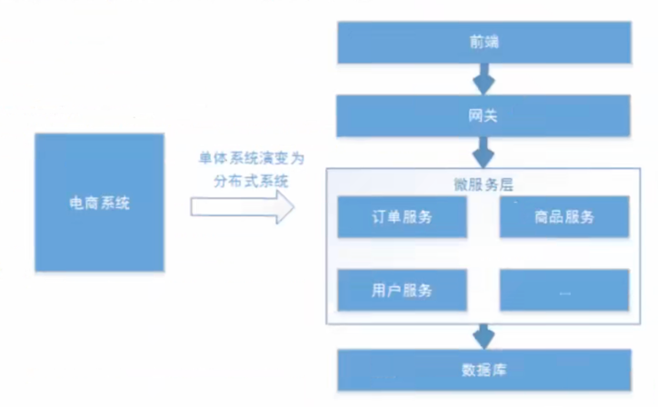  
+ 分布性：每个部分可独立部署
+ 伸缩性：每个部分可集群部署，进行硬件或软件扩容  
+ 共享性：每个部分可作为共享资源对外提供服务  
+ 开放性：每个部分可根据需求对外发布第三方接口  
# 2. 分布式系统认证需求  
+ 需求考虑：
  + 分布式系统每个服务都有认证、授权需求，但不可能每个服务都做一套认证授权，因此需要独立都认证服务来统一处理  
  + 分布式系统不仅要对内提供认证，还需要对第三方系统提供认证  
+ 基于以上考虑，总结需求如下：
  + 统一认证授权
    + 提供独立认证服务，统一处理认证授权  
    + 无论何种用户、客户端(web、h5、app)，均采用一致的认证、权限、会话机制，实现统一的认证授权  
    + 认证方式需可扩展，支持各种认证需求，如：账号密码、短信、二维码、人脸识别，并可灵活切换  
  + 应用接入认证  
    + 提供安全的系统对接机制，可开放部分api给第三方使用，系统内部及第三方应用均采用统一机制接入  
# 3. 分布式系统认证方案  
## 3.1 技术选型  
1. 基于session方式
+ 分布式系统基于session认证会出现一个问题：认证服务完成认证后，客户端请求需要将session带到其他服务，否则需要重新授权  
+ 解决思路大致分为三个方向：  
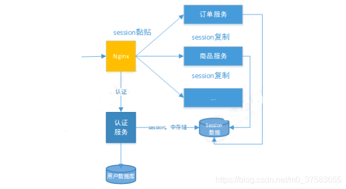  
+ **session复制：** 多个服务间同步session，如tomcat的session共享机制  
+ **Session黏贴：** 用户访问集群时，强制指定后续的所有请求落到同一个服务上，如nginx的哈希一致性策略  
+ **Session集中存储：** 将Session存入分布式缓存中，所有服务实例统一从分布式缓存取session，如redis  
+ **优点：** 更好的在服务端对会话进行控制，安全性高  
+ **缺点：**  
  + session方式基于cookie，在移动客户端无法有效使用  
  + cookie无法跨域  
  + 随着系统的扩展，需要提高session的复制、黏贴及存储的容错性  
2. 基于token方式  
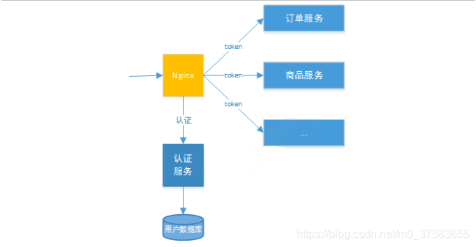  
+ **优点：** 
  + 服务端不要存储认证数据，易维护扩展性强  
  + 客户端可以把token放在任意地方，可实现web和App的统一认证  
+ **缺点：** 
  + token由于包含了用户信息，一般数据量较大，每次请求都要传递token，因此比较占带宽  
  + token的签名验签操作会给cpu带来额外负担  
  + 由于token中包含了用户信息，有一定的安全风险(可通过加密方式解决)  
## 3.2 技术方案  
+ 基于上述选型分析，结合分布式系统认证需求，token更适合分布式系统：  
  + 适合统一认证要求，客户端、系统内部应用、第三方应用遵循一致的认证机制  
  + 对于第三方应用接入更合适，可使用开放协议Oauth2、jwt等  
  + 服务端无需存储会话信息，减轻服务端压力
+ 本工程分布式系统认证技术方案如下：  
+ 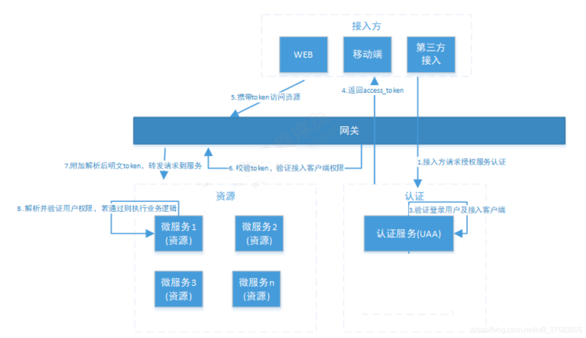  
+ 第5步网关等权限校验和第8步微服务等权限校验并不相同  
  + 网关是针对客户端的权限校验，判断这个客户端是否有权限访问，一般会提前颁发给客户端key和密钥  
  + 微服务权限校验是针对该客户端是否有该服务的访问权限，甚至细粒度到方法  
# 4. Oauth2.0  
## 4.1 介绍  
+ Oauth(开放授权)是一个开放标准，允许用户授权第三方应用访问他们存储在另外的服务提供者上的信息，而不需要将用户名和密码提供给第三方应用或分享他们数据的所有内容  
+ OAuth2.0是OAuth协议的延续版本，但不兼容Oauth1.0  
+ 举例：  
例如在一些视频网站可以采用qq登录而不要注册成为该网站的用户。那么qq便对该网站提供了第三方接口，以供该网站获取qq用户信息去完成网站登录  
+ **注意：** 
  + 虽然在视频网站输入了qq账号密码，但是账号密码是发往qq服务器的，视频网站并不会拿到账号密码(正规网站不会拿，而且还会把你的账号密码加密防止网络传输过程中外泄，但是黑网站会存你的账号密码)  
  + qq服务器校验完账号密码后返回一个token给视频网站  
  + 视频网站可以通过这个token从qq服务器拿到部分qq对第三方开放的用户信息  
+ 大致授权流程如下：  
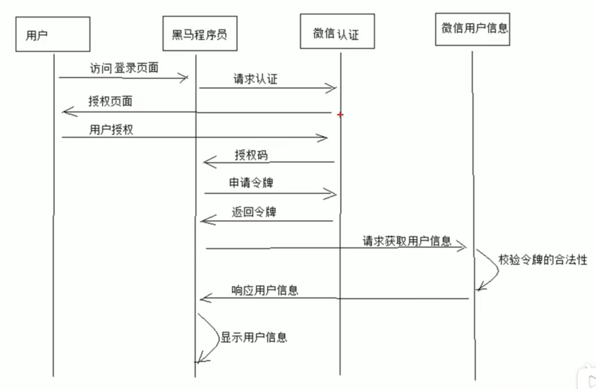  
+ Oauth2.0官方流程图如下：  
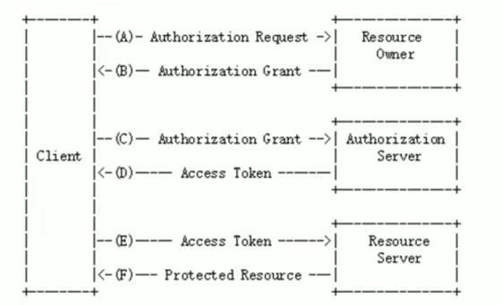  
+ **注意：** 
  + 在实际项目中，并不是所有客户端都可以接入授权服务器
  + 需要服务提供方给准入的第三方颁发一个身份，作为接入凭据(即3.2技术方案流程图中提到的网关这一层的权限校验)  
  + `client_id`，客户端标识  
  + `client_secret`，客户端密钥  
# 5. Spring-Security OAuth2  
+ Spring-Security OAuth2是基于OAuth2标准协议实现的安全框架  
+ 它包含了两个服务：
  + **授权服务(Authrization Server)：** 应包含对接入端及登入用户对合法性进行验证并颁发token等功能  
    + 请求端点可通过springmvc控制器实现：  
    + **AuthorizationEndpoint**服务于认证请求，默认url: `/oauth/authrize`  
    + **TokenEndpoint**服务于访问令牌等请求，默认url: `/oauth/token`  
  + **资源服务(Resource Server)：** 应包含保护资源，拦截非法请求等功能，对请求中对token进行解析鉴权等  
    + 可通过下面过滤器实现资源服务：  
    + **OAuth2AuthenticationProcessingFilter**用来解析鉴权token  

# 6. 搭建工程  
1. 创建maven项目  
2. 配置pom.xml文件
3. 创建相关文件夹
4. 创建启动类
5. 创建配置文件applcation.yml  

## 6.1 授权服务配置  
+ 在任意配置类添加@EnableAuthorizationServer注解  
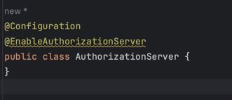  
+ 在AuthorizationServer类中进行相关配置，一共三个`configure()`方法
  + 客户端管理，参考代码中注释信息
  + 管理令牌
    + 通过`AuthorizationServerTokenServices`接口进行令牌管理
      + 可以自己实现`AuthorizationServerTokenServices`接口，需要继承`DefaultTokenServices`这个类
    + 但是持久化令牌是通过另一个接口`TokenStore`来实现的
      + `TokenStore`有一个默认实现`InMemoryTokenStore`，即存储在内存中
      + 除此之外还有一些预定义实现：
        + `JdbcTokenStore`：基于数据库存储令牌，可以在不同服务器间共享令牌信息，使用该方式时需要注意引入`spring-jdbc`相关依赖
        + `JwtTokenStore`：该方式服务端不存储令牌(可去了解什么是jwt)，它可以把令牌相关数据进行编码，但是它有两个缺点：
          + 想要撤销一个已经授权的令牌非常困难，所以通常用来处理生命周期较短的令牌或者撤销刷新令牌
          + 如果加入了较多用户凭证信息，令牌的占用空间会较大
    + 单独建立生成令牌的配置文件类`TokenConfig`
    + 在`AuthorizationServer`中配置令牌管理
  + 配置令牌访问端点及授权类型相关设置
    + `AuthorizationServerEndpointsConfigurer`的实例可以完成令牌服务及令牌访问端点的配置
      + 配置授权类型'Grant Types'
      + 在`AuthorizationServer`中配置令牌
  + 配置令牌约束
    + 在`AuthorizationServer`中配置令牌约束  

## 6.2 授权服务测试  
### 6.2.1 授权码模式测试  
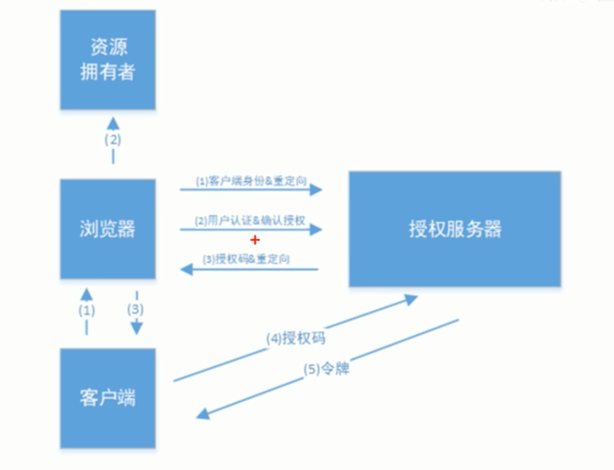  
+ 浏览器访问: http://localhost:53020/oauth/authorize?client_id=c1&response_type=code&scope=all&redirect_uri=https://www.baidu.com  
+ 跳转到授权页面  
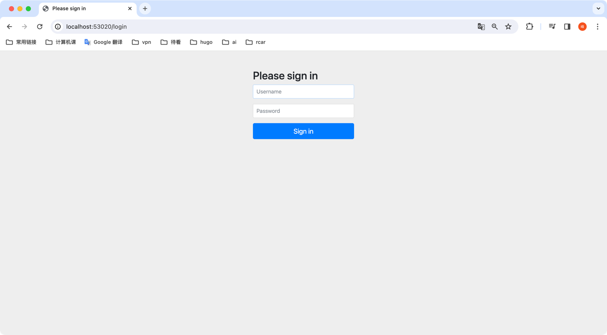  
+ 输入userDetailService中定义的账号密码  
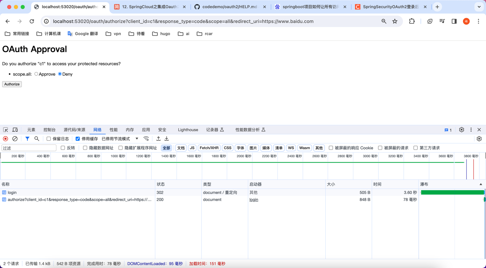  
+ 若认证成功，需手动选择approve授权
+ 之后路径中会返回code码  
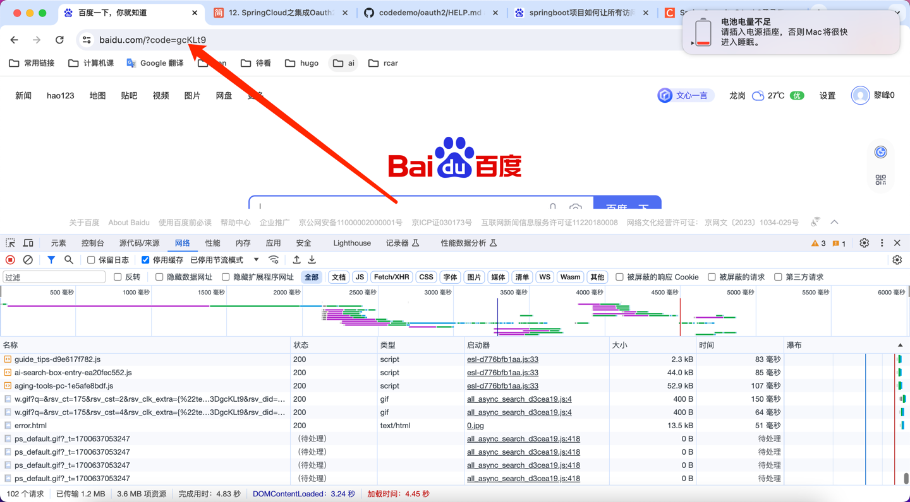  
+ 然后用postman发送post请求(附带刚刚获取的code)获取token：http://localhost:53020/uaa/oauth/token  
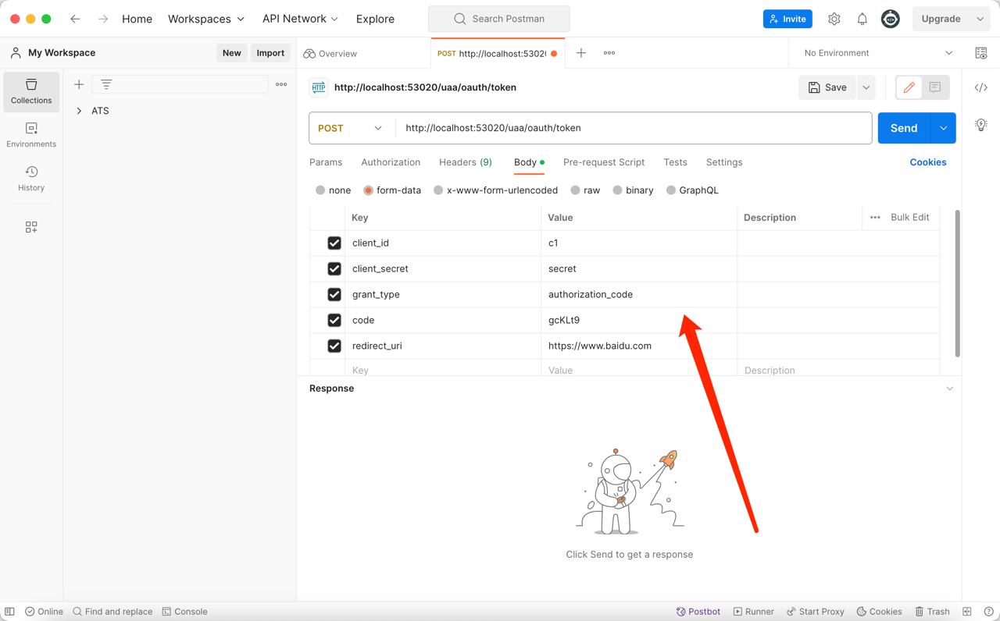  
+ 成功获取token如下图  
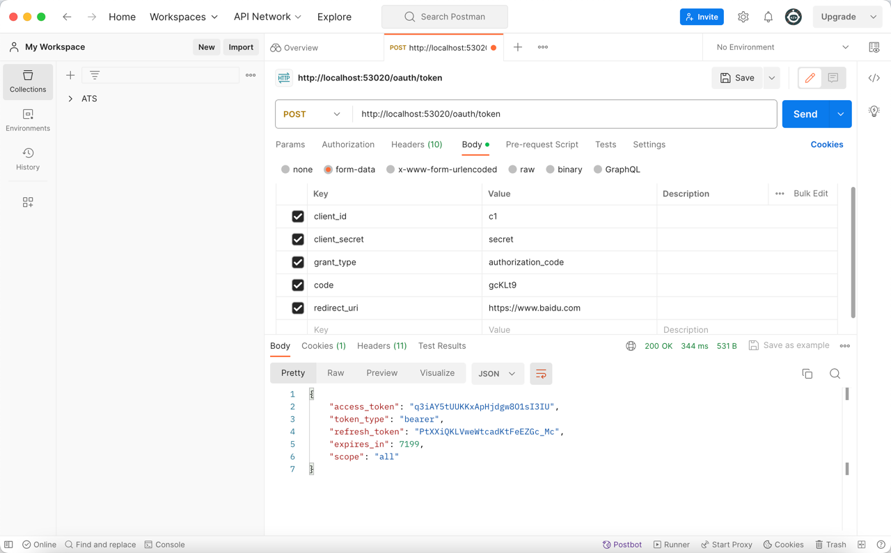

