# 1.基本概念
## 1.1什么是认证
**认证：** 用户认证是判断一个用户身份是否合法的过程
## 1.2 什么是会话
+ 在用户第一次认证成功后，为避免后续每次请求再进行认证，可将用户信息保存在会话中。
+ **会话**就是保持用户当前登录状态的机制，常见的会话有session方式或token方式
### 1.2.1 基于session
+ 传统的session+cookie方式如下图
  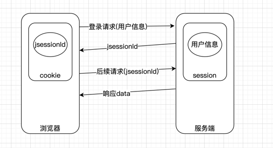
+ 它的基本流程是：
    + 用户登录请求时附带用户信息发送到web服务端
    + web服务端收到信息后进行认证和授权，认证通过后会将用户信息存到session中
        + 这里有几点需要注意：
        1. session默认存储在内存中，但实际项目往往会将session存储到缓存中间件或者持久化数据库中
        2. 实际项目中用户信息存入session时是需要加密的，常用的加密算法如**md5+盐、sha256、RSA**等
    + 第一次登录请求的响应中，会在cookie中存入一个jsessionId
    + 当第一次请求登录完毕，只要不关闭浏览器或手动清楚cookie，cookie就会一直存在
        + 但是jsessionId往往是有有效期的，超过有效期浏览器中的jsessionId就无效了
    + 后续的浏览器请求会附带jsessionId，服务端会根据jsessionId找它对应的session，从而获取已经登录的用户信息
    + 这样服务端就不用再进行认证而直接响应data
### 1.2.2 基于token
+ token认证方式如下图
  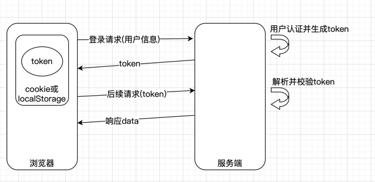
+ 它的基本流程是：
    + 客户端登录请求发送至服务端时进行用户认证并生成token
        + token生成方式有很多，常见的如jwt
    + 服务端将token返回至客户端，存储在浏览器cookie或localStorage中
        + **注意：** token中包含用户隐私信息，因此jwt生成token后往往会再加密一次再返回
    + 客户端后续请求中会附带token，服务端会解析并校验token
    + 校验通过后返回响应数据
### 1.2.3 区别
1. session方式信息存储在服务端，token方式信息存储在客户端
2. session方式要求客户端支持cookie，token方式一般不限制客户端存储方式
### 1.2.4 小结
现如今基本都是用token方式，原因如下：
1. 存储方式受限，现在对架构往往是分布式架构且前后端分离，以及可能会有app客户端，此时客户端不支持cookie，因此无法再用session方式
2. cookie跨域问题，cookie只会在同一域名对请求中共享，现在的分布式架构往往是多域名导向的，因此cookie不再合适
+ **虽然session方式存在以上缺点，但是也有相应的解决方案来支持session克服上述问题，但复杂且不常用，如session共享、分布式缓存、nginx负载均衡的哈希一致性算法等**
## 1.3 什么是授权
+ **授权：** 用户认证通过后，根据用户权限来控制用户访问资源的过程
## 1.4 授权数据模型
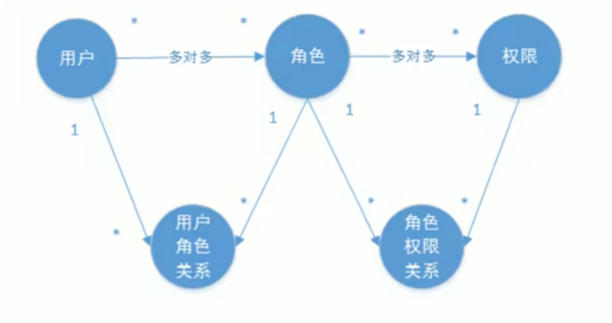
+ 在实际项目中，上图每一个节点代表一张数据表
## 1.5 RBAC
### 1.5.1 基于角色的访问控制
+ RBAC(Role-Based Access Control)，按角色进行授权，访问控制流程如下：
  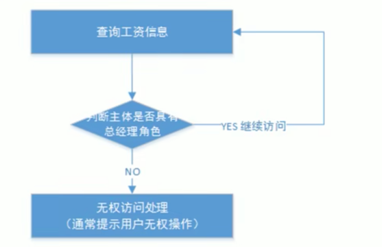
+ 基于上述流程，授权代码示例如下：
```java
if(主体.hasRole("总经理角色id")) {
    查询工资
        }
```
+ 若查询工资需要的角色为总经理和部门经理，代码逻辑变为：
```java
if(主体.hasRole("总经理角色id") || 主体.hasRole("部门经理角色id")) {
    查询工资
        }
```
+ **由此可见，修改角色权限时就需要修改授权代码，可扩展性差**
### 1.5.2 基于资源的访问控制
+ RBAC(Resource-Based Access Control)，按资源进行授权，访问控制流程如下：
  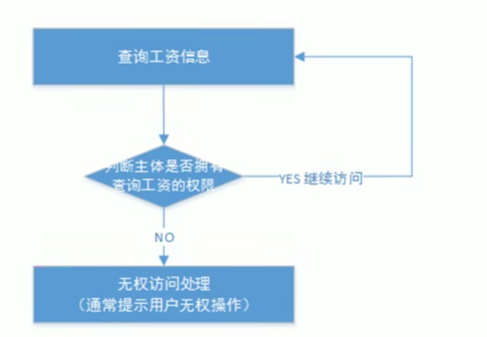
+ 授权代码如下：
```java
if(主体.hasPermission("查询工资权限标识")) {
    查询工资
        }
```
+ **优点：** 在系统设计阶段，定义好资源的权限标识，即便角色变化也不需要修改授权代码，系统可扩展性强
# 2.基于session的认证方式
## 2.1 认证流程
+ 流程参考1.2.1
+ session认证是基于Servlet规范制定，用户通过HttpSession的操作方法即可实现，HttpSession的相关api如下：
  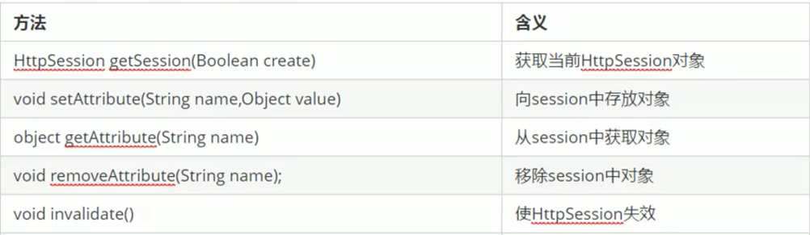
+ 示例如下：
  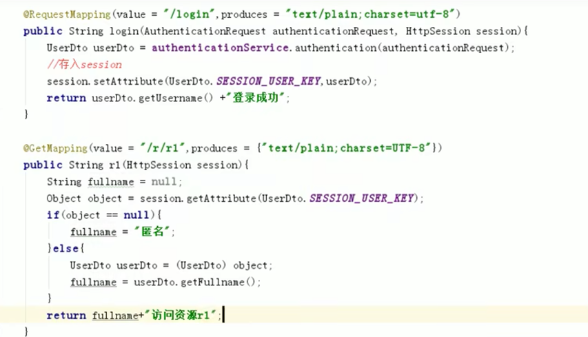
  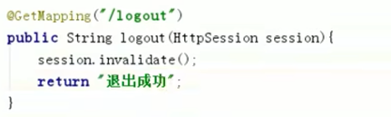
## 2.2 创建工程
+ session认证流程demo过于落后，此工程不再展示  
+ 核心技术点便是springmvc的视图解析器、视图控制器、拦截器，可参考链接：https://lyffin1997.github.io/spring/springboot%E5%A6%82%E4%BD%95%E6%8E%A5%E7%AE%A1springmvc/  
+ **注意：** springmvc的拦截器的执行顺序在过滤器之后  
+ 过滤器和拦截器可以参考这篇文章：https://blog.csdn.net/xp_lx1/article/details/121835173  
## 2.3 springmvc流程  
+ 这一节参考即可  
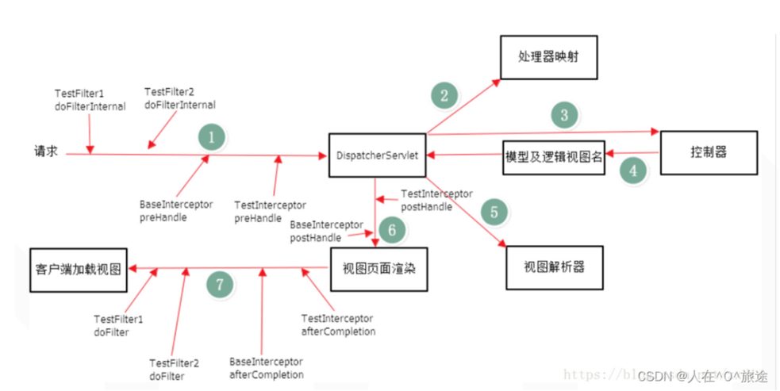  
1. 用户发起请求到前端控制器（Controller）
2. 前端控制器没有处理业务逻辑的能力，需要找到具体的模型对象处理（Handler），到处理器映射器（HandlerMapping）中查找Handler对象（Model）。
3. HandlerMapping返回执行链，包含了2部分内容： ① Handler对象、② 拦截器数组
4. 前端处理器通过处理器适配器包装后执行Handler对象。
5. 处理业务逻辑。
6. Handler处理完业务逻辑，返回ModelAndView对象，其中view是视图名称，不是真正的视图对象。
7. 将ModelAndView返回给前端控制器。
8. 视图解析器（ViewResolver）返回真正的视图对象（View）。
9. （此时前端控制器中既有视图又有Model对象数据）前端控制器根据模型数据和视图对象，进行视图渲染。
10. 返回渲染后的视图（html/json/xml）返回。
11. 给用户产生响应。
# 3. springsecurity  
## 3.1 结构  
+ springsecurity初始化时，会创建一个名为`SpringSecurityFilterChain`的Servlet过滤器，类型是`org.springframework.security.web.FilterChainProxy`,它实现了`javax.servlet.Filter`，外部进球进来时，会先经过此类  
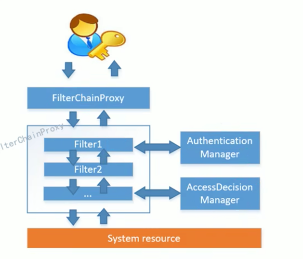  
+ 如上图所示，真正起作用的是`SpringSecurityFilterChain`中的各个filter  
+ filter不直接进行认证和授权，而是交给Authentication(认证管理器)和AccessDecisionManager(决策管理器)  
+ 代码层次如下图：  
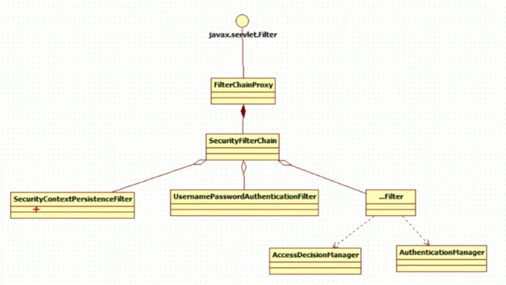  
+ **总的来说，springsecurity的功能是由一系列过滤器链相互配合完成，如下图所示：**  
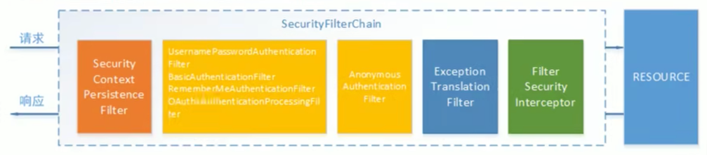  
+ **UsernamePasswordAuthenticationFilter：** 用于处理表单提交的认证(即账号密码认证)，其内部还有认证成功和失败后的处理器`AuthenticationSuccessHandler`和`AuthenticationFailureHandler`  
+ **FilterSecurityInterceptor:** 用于保护web资源，使用`AccessDecisionManager`对当前用户进行授权访问  
+ **ExceptionTranslationFilter：** 能够捕获来自`FilterChain`的所有异常，并处理其中的`AuthenticationException`和`AccessDeniedException`，其他异常会继续抛出  
## 3.2 认证流程  
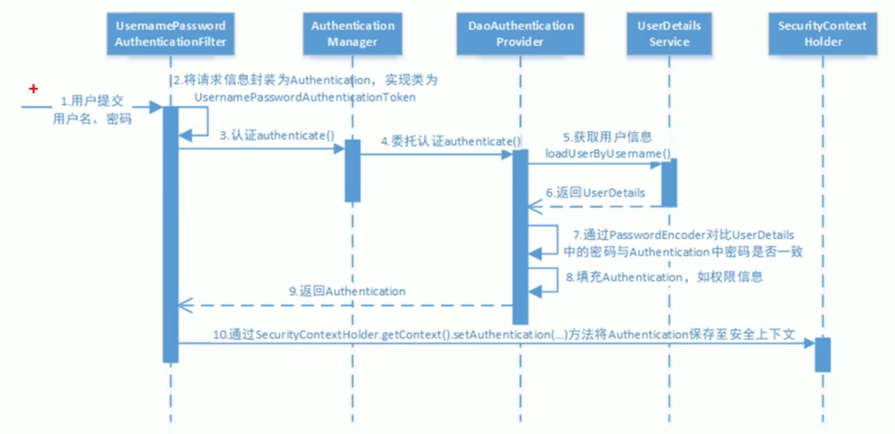  
1. 认证请求先进入UsernamePasswordAuthenticationFilter
2. UsernamePasswordAuthenticationFilter将账号密码信息存入UsernamePasswordAuthenticationToken中  
3. ……太白痴了对着图和源码看就行了懒得码字了  
4. 第一次认证完成后，用户信息默认存储在session中，session默认存储在内存中，并且返回给前端一个sessionid(浏览器)，下一次请求发往该域名时，会自带这个sessionid，服务端会自动校验这个sessionid的有效性，可以配置sessionid失效后的策略，如返回登录页。若sessionid校验通过，会继续走认证流程  
5. 在SecurityContextPersistenceFilter中会从session获取用户信息，并执行后续filter链，但是在UsernamePasswordAuthenticationToken会跳过账号密码校验，直接执行下一步，后续认证流程和之前一样，最后用户信息保存在SecurityContextHolder中，并且再次存入session(即更新操作)
## 3.3 新建工程  
### 3.3.1 软件环境  
+ springboot: 2.7.17  
+ maven: 3.8.4  
+ jdk: 1.8  
### .3.3.2 整合步骤  
1. pom中引入依赖，主要是springboot-web依赖和springsecurity依赖
2. 创建配置文件SecurityConfig  
3. 创建获取用户信息接口实现类LoginUserDetailsService(该类也可在SecurityConfig中通过@bean注解注册到容器中)  
4. 创建用户、角色、权限实体类  
5. 创建用户接口及实现类UserService、UserServiceImpl  
## 3.4 AuthticationProvider  
+ 这是一个接口，其中有`authticate()`和`support()`两个方法  
+ 由流程图可知实际的认证实现过程由provider完成
+ 认证的方式有很多种，在manager中维护着一个List<AuthenticationProvider>列表  
+ manager会根据`support()`方法判断调用哪种provider实现类，不同实现类支持的认证方式不同  
+ 判断依据是不同认证方式传入provider的参数类型不同，如账号密码认证传入的类型为UsernamePasswordAuthenticationToken
+ 其中账号密码认证的实现类是DaoAuthenticationProvider，可以看到它基类中的`support()`方法表明了支持传入参数类型为UsernamePasswordAuthenticationToken  
+ 我们也可根据需求自定义一个provider来支持特定的认证方式  
## 3.4 授权流程  
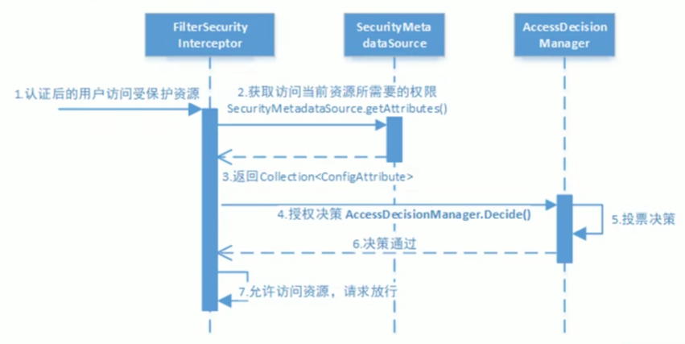  
+ 在config文件中通过`http.authorizeRequests()`开启授权保护，`http.authenticated()`开启认证保护  
+ 由springsecurity过滤链图可知，在访问资源前，还需要经过`FilterSecurityIntereptor`  
### 3.4.1 AccessDecisionManager  
+ 授权决策实际由AccessDecisionManager执行  
+ 采用投票的方式来决定请求是否能访问资源  
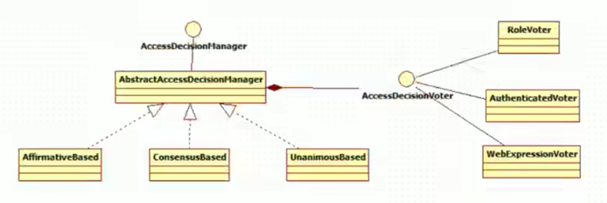  
+ 由上图可知AccessDecisionManager包含了一系列AccessDecisionVoter来投票，最终根据投票结果做出决策  
  + springboot内置了AuthenticatedVoter、RoleVoter、WebExpressionVoter，感兴趣可自行学习  
+ springboot内置了三个AccessDecisionManager实现类：AffirmativeBased、ConsensusBased、UnanimousBased  
+ AffirmativeBased(默认)：
  + 只要有AccessDecisionVoter的投票为ACCESS_GRANTED则同意访问  
  + 全部弃权也通过  
  + 若没有一个赞成，但是有反对票，则抛出AccessDeniedException  
+ ConsensusBased：  
  + 赞成票多于反对票则同意访问  
  + 反对票多余赞成票抛AccessDeniedException  
  + 若赞成票与反对票相同且不为0，且属性`allowIfEqualGrantedDeniedDecisions`为true，则同意访问，否则抛AccessDeniedException，`allowIfEqualGrantedDeniedDecisions`默认为ture  
  + 若都是弃权，则根据`allowIfAllAbstainDecisions`值而定，若为true则同意访问，否则抛AccessDeniedException，`allowIfAllAbstainDecisions`默认为false  
+ UnanimousBased(上面两个是一次性把Collection<ConfigAttribute>传入Voter，而这个是一次传一个ConfigAttribute)：  
  + 受保护对象都某一个ConfigAttribute被任意AccessDecisionVoter投了反对票，则抛出AccessDeniedException  
  + 如果没有反对票，但是有赞成票，则通过  
  + 若全弃权，则根据`allowIfAllAbstainDecisions`而定，true通过，false抛AccessDeniedException


